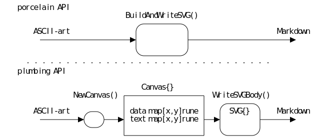

  ###  Overview

Package goat formats "ASCII-art" drawings into Github-flavored Markdown.

All output is buffered into the object SVG, then written to the output
stream.

  ### Functions

#### func BuildAndWriteSVG

      func BuildAndWriteSVG(src io.Reader, dst io.Writer,
      	svgColorLightScheme, svgColorDarkScheme string)
BuildAndWriteSVG reads in a newline-delimited ASCII diagram from src and
writes a corresponding SVG diagram to dst.

  ### Types

#### type Bridge

      type Bridge struct {
      	// Has unexported fields.
      }
Bridge corresponds to combinations of "-)-" or "-(-" and is displayed as the
vertical line "hopping over" the horizontal.

#### type Canvas

      type Canvas struct {
      	// units of cells
      	Width, Height int

      	// Has unexported fields.
      }
Canvas represents a 2D ASCII rectangle.

#### func NewCanvas

      func NewCanvas(in io.Reader) (c Canvas)
NewCanvas creates a fully-populated Canvas according to GoAT-formatted text
read from an io.Reader, consuming all bytes available.

#### func (*Canvas) Bridges

      func (c *Canvas) Bridges() (bridges []Drawable)
Bridges returns a slice of all bridges, "-)-" or "-(-", composed as a
sequence of either type Bridge or type Line.

#### func (*Canvas) Circles

      func (c *Canvas) Circles() (circles []Circle)
Circles returns a slice of all 'o' and '*' characters not considered text.

#### func (*Canvas) HalfSteps

      func (c *Canvas) HalfSteps() (lines []Line)

#### func (*Canvas) Lines

      func (c *Canvas) Lines() (lines []Line)
Lines returns a slice of all Line drawables that we can detect -- in all
possible orientations.

#### func (*Canvas) MoveToText

      func (c *Canvas) MoveToText()
Move contents of every cell that appears, according to a tricky set of
rules, to be "text", into a separate map: from data[] to text[]. So data[]
and text[] are an exact partitioning of the incoming grid-aligned runes.

#### func (*Canvas) RoundedCorners

      func (c *Canvas) RoundedCorners() (corners []RoundedCorner)
RoundedCorners returns a slice of all curvy corners in the diagram.

#### func (*Canvas) Text

      func (c *Canvas) Text() (text []Text)
Text returns a slice of all text characters not belonging to part of the
diagram. Must be stably sorted, to satisfy regression tests.

#### func (*Canvas) Triangles

      func (c *Canvas) Triangles() (triangles []Drawable)
Triangles detects intended triangles -- typically at the end of an intended
line -- and returns a representational slice composed of types Triangle and
Line.

#### func (*Canvas) WriteSVGBody

      func (c *Canvas) WriteSVGBody(dst io.Writer)
WriteSVGBody writes the entire content of a Canvas out to a stream in SVG
format.

#### type Circle

      type Circle struct {
      	// Has unexported fields.
      }
Circle corresponds to "o" or "*" runes in the absence of surrounding
alphanumerics.

#### type Drawable

      type Drawable interface {
      	// Has unexported methods.
      }
Drawable represents anything that can Draw itself.

#### type Index

      type Index struct {
      	// units of cells
      	X, Y int
      }
Index represents a position within an ASCII diagram.

#### type Line

      type Line struct {
      	// Has unexported fields.
      }
Line represents a straight segment between two points 'start' and 'stop',
where 'start' is either lesser in X (north-east, east, south-east), or equal
in X and lesser in Y (south).

#### type Orientation

      type Orientation int
Orientation represents the primary direction that a Drawable is facing.

      const (
      	NONE Orientation = iota // No orientation; no structure present.
      	N                       // North
      	NE                      // Northeast
      	NW                      // Northwest
      	S                       // South
      	SE                      // Southeast
      	SW                      // Southwest
      	E                       // East
      	W                       // West
      )
#### type RoundedCorner

      type RoundedCorner struct {
      	// Has unexported fields.
      }
RoundedCorner corresponds to combinations of "-." or "-'".

#### type SVG

      type SVG struct {
      	Body   string
      	Width  int
      	Height int
      }

#### func (SVG) String

      func (s SVG) String(svgColorLightScheme, svgColorDarkScheme string) string
See: https://drafts.csswg.org/mediaqueries-5/#prefers-color-scheme

#### type Text

      type Text struct {
      	// Has unexported fields.
      }
Text corresponds to any runes not reserved for diagrams, or reserved runes
surrounded by alphanumerics.

#### type Triangle

      type Triangle struct {
      	// Has unexported fields.
      }
Triangle corresponds to "^", "v", "<" and ">" runes in the absence of
surrounding alphanumerics.

