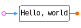

<!-- XX ? Move this file down to .github/, because its contents are GitHub-specific.
	 -->
<!-- https://docs.github.com/en/get-started/writing-on-github/working-with-advanced-formatting/organizing-information-with-collapsed-sections#creating-a-collapsed-section -->

# GoAT: Go-based Text-Art to SVG refinement

<!-- Github-specific status icon

     Github requires explicitly binding a repository owner's username in the text of a README,
     implying that a badge in README.md cannot both reflect the status of a test Action after a
	 contributor pushes to his pull request branch, and
	 the run of that same test Action after the upstream owner merges the pull request
	 into his 'main' branch.  See:

	    https://docs.github.com/en/actions/monitoring-and-troubleshooting-workflows/adding-a-workflow-status-badge

	GitHub Community forum shows numerous similar issues with badges:
	  https://github.com/orgs/community/discussions/categories/actions?discussions_q=is%3Aopen+category%3AActions++badge.svg

	  X ?? Don't use badges. Instead, pay attention to Action result status.
             XX  But how to attest of self-test success to end users?
  -->
<!--  -->

## What **GoAT** Can Do For You

- From a chunky text-art input, render smooth, multi-colored SVG with embedded links.

- Express your ideas in either of two input formats, subsets of well-known conventions:
  1. [ASCII](./ascii/)-based, as popularized by [MarkDeep](http://casual-effects.com/markdeep/)
  2. [Unicode UTF-8](./utf8/) [BOX](https://www.unicode.org/charts/PDF/U2500.pdf) characters

- Style graphics globally within your diagram, by specifying CSS files on
the command line.

- Style individual text strings, by referring to
individual CSS rules from markup bracketing your text.

## You Will Also Need

#### A fixed-pitch font with 2:1 height:width ratio as presented by your editor and terminal emulator
Most fixed-pitch or "monospace" Unicode fonts maintain a 2:1 aspect ratio for
characters in the ASCII range,

   > On Ubuntu, satisfactory fonts are scarce -- perhaps the best is "DejaVu Sans Mono".

#### Editor support

Graphical- or rectangle-oriented text editing capability,
provided either by special modes within your text editor, or a specialized graphical editor.
Your best option may depend upon whether you prefer to create diagrams with
graphics expressed in
 [ASCII](./ascii/) or [UTF-8](./utf8/)
 -- see the READMEs for some hints.

## Installation

```
$ go install github.com/blampe/goat/cmd/goat@latest
```

## "Hello, world", two ways
### Markdeep-style ASCII input

```
     .------------.
o-->|Hello, world +--*
    '------------'

```


### UTF-8 BOX input
```
    ╭────────────┐
○──►│Hello, world├─●
    └────────────╯

```


## Styling with CSS
### Global styling
Any number of `.css` files may be specified on the command line,
 for inclusion within the output file's (single) `<svg>` element.
To style all the various SVG drawing elements emitted by GoAT,
 a CSS file might contain these rules:
```
/* Each of the CSS rules below begins with a CSS selector assumed by one of
 * the SVG marking elements emitted by GoAT, so the properties inside
 * will be globally effective.
 * The sample of CSS properties below was chosen for obviousness in demonstration
 * rather than suitability for any production use in. */

/* CSS selector consists of the SVG element tag only. */
text {
    fill: inherit;
}

/* Selector consists of GoAT's choice of CSS class name, only, because GoAT draws "lines"
 * by stringing together various SVG elements depending upon topology or geometry.
 * Class name chosen is "path" to avoid any suggestion that no curves are possible. */
.path {
    stroke: #00B;
}
@media (prefers-color-scheme: dark) {
    .path {
	stroke: #ED8;
    }
}

/* Selector consists of GoAT's choice of CSS class name only, because
 * the name of the SVG element actually used is too general to suggest
 * a diagramatic arrowhead. */
.arrowhead {
    stroke-width: 2;  /* intrude into left and right neighbors */
    stroke: #29F;
    fill: none;
}

/* Selectors consist of the SVG element tag, qualified by GoAT's assignment of
 * class "filled"/"hollow" based on recognition of a character code in the diagram source text. */
circle.filled {
    fill: #F60;
    stroke: none;
}
circle.hollow {
    stroke: #F6F;
    stroke-width: 2;
}

```
and produce this SVG image



### Dark-mode support
Note the `prefers-color-scheme: dark` above.
This switches all paths (in the sense of "lines") between yellow and blue,
because yellow is peculiarly hard to distinguish against a light background,
and its hue-complement blue against a dark background.

To see GoAT use the `@media` switch to dynamically change the drawing color,
 toggle between dark and light either the GitHub UI or your browser's color scheme.

## Fine-grained CSS rule specification, by diagram markup

GoAT supports styling of `<text>` elements at the granularity of individual words.
A word, or left-to-right sequence of words, is selected for alternate styling
 by bracketing it within a pair of characters that you the user choose
 to reserve for the purpose.

For each such pair, GoAT generates an anchor element `<a>...</a>` to enclose
 the printing `<text>` elements.
The anchor element specifies a list of CSS classes, and their effects cascade
 down to the wrapped `<text>` elements.

Returning to our two ASCII and UTF-8 "Hello, world" examples:

### ASCII
The command line
```
    go run ./cmd/goat/ -io ./ascii/_README/hello-world.styled.txt embed:palette/bold.css embed:style/ascii.css
```
when executed at the top of the cloned GoAT source tree, combines a text file containing
```
       .---------------.
` o-->|  Hello,‗world‗ +--* `
      '---------------'

```
with the CSS content
```
.bold {
    goat-anchor-marks: "··";
    font-weight: bold;
}
.italic {
    goat-anchor-marks: "``";
    font-style: italic;
}
.underline {
    goat-anchor-marks: "‗‗";  /*  -- resort to UTF-8 */
    text-decoration: underline;
}

```
to produce this SVG image


For further details, see
[ascii/README.md](./ascii/README.md)

### UTF-8 BOX characters
The command line
```
    go run ./cmd/goat/ -io ./utf8/_README/hello-world.styled.txt -utf8 embed:palette/bold.css embed:style/utf8.css
```
combines a text file containing
```
      ╭──────────────┐
/ ○──►│ Hello,_world_├──● /
      └──────────────╯

```
with the CSS content
```
.bold {
    goat-anchor-marks: "**";
    font-weight: bold;
}
.italic {
    goat-anchor-marks: "//";
    font-style: italic;
}
.underline {
    goat-anchor-marks: "__";
    text-decoration: underline;
}
.code {
    goat-anchor-marks: "``";
    stroke: inherit;
}

```
produces this SVG image


For further details, see
[utf8/README.md](./utf8/README.md)


## CSS property "goat-anchor-href"

GoAT can add web links to text strings within your diagram.
By appending to the GoAT command line above also a path to a CSS file containing this:
```
.underline_href {
    goat-anchor-marks: "__";
    goat-anchor-href: "https://www.worldometers.info/";
}

```
we get an SVG that looks like this, with a clickable web URL (the link below is however disabled);


The above example exposes an environmental constraint:
 GitHub-flavored Markdown disallows
"inline" [\<svg\> elements](https://developer.mozilla.org/en-US/docs/Web/SVG/Element/svg)
 so the above SVG is
["embedded"](https://developer.mozilla.org/en-US/docs/Learn/HTML/Multimedia_and_embedding/Images_in_HTML)
into the HTML output of the Markdown processor, with the help of an HTML
[\](https://developer.mozilla.org/en-US/docs/Web/HTML/Element/img),
element, and web browsers disable outgoing links from anchor elements within "embedded" SVG files.

### Comparable Projects
- [asciitosvg](https://github.com/asciitosvg
- [Svgbob](https://github.com/ivanceras/svgbob

### Project Tenets
1. Defaults suitable for simple drawings are provided; all can be overridden by the user.
2. Incoming data validated promptly; errors fatal immediately; diagnostic messages
   point to the first incorrect byte.
3. Dark mode and light mode are co-equal peers.
4. Utility and ease of integration into existing projects are paramount.
5. TXT and SVG intelligibility are co-equal in priority.
6. Column-alignment of TXT not to be sacrificed -- only width-8 characters allowed.
7. Per-platform support limited to a single widely-available fixed-pitch TXT font.
8. Compatibility with MarkDeep desired, but not required.
ory hierarchy [.dir-locals.el](../.dir-locals.el) 

### Diagram Input sources
#### Non-graphical
- GRAPH::EASY
- [D2](https://d2lang.com/blog/ascii/)
- [Diagon](https://diagon.arthursonzogni.com)
- MermaidJS
- [Pikchr](https://pikchr.org/)
#### Graphical editors
- [AsciiFlow](https://github.com/lewish/asciiflow)
- [Cascii](https://github.com/casparwylie/cascii-core)
- Textik
- specialized sub-modes of general text editors (Emacs, Vim)
#### Emacs-specific hints
To preserve your freedom to use some other body font outside of utf8 drawings,
 by limiting DejaVu Sans Mono (or other "pure-monospace" font) to only utf8 drawings,
 consider the following techniques for automatically selecting suitable fonts:
 1. font-lock custom faces
 2. GoAT-compatible face selected for all text-mode files within
    a directory, with a [`.dir-locals.el`](./.dir-locals.el) file.
