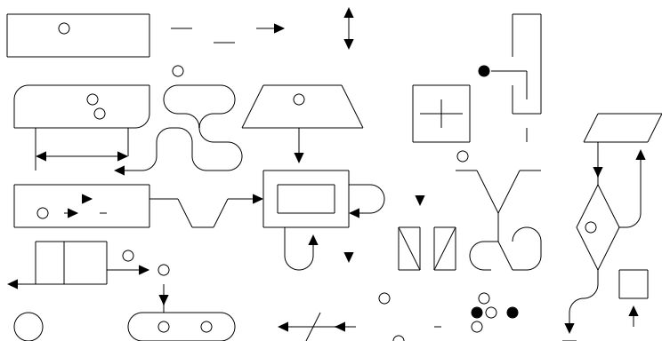

# GoAT: Go ASCII Tool

This is a Go implementation of [markdeep.mini.js](1)'s ASCII diagram
generation.

## Example

This input:

```
.-------------------.                           ^                      .---.
|    A Box          |__.--.__    __.-->         |        |  _ -        |   |
|                   |        '--'               v                      |   |
'-------------------'                                                  |   |
                       Round                                       *---(-. |
  .-----------------.  .-------.    .----------.         .-------.     | | |
 |   Mixed Rounded  | |         |  / Diagonals  \        |   |   |     | | |
 | & Square Corners |  '--. .--'  /              \       |---+---|     '-)-'       .--------.
 '--+------------+-'  .--. |     '-------+--------'      |   |   |       |        / Search /
    |            |   |    | '---.        |               '-------'       |       '-+------'
    |<---------->|   |    |      |       v                Interior                 |     ^
    '           <---'      '----'   .-----------.              ---.     .---       v     |
 .------------------.  Diag line    | .-------. +---.              \   /           .     |
 |   if (a > b)     +---.      .--->| |       | |    | Curved line  \ /           / \    |
 |   obj->fcn()     |    \    /     | '-------' |<--'                +           /   \   |
 '------------------'     '--'      '--+--------'      .--. .--.     |  .-.     +Done?+-'
    .---+-----.                        |   ^           |\ | | /|  .--+ |   |     \   /
    |   |     | Join        \|/        |   | Curved    | \| |/ | |    \    |      \ /
    |   |     +---->  o     -o-         '-'  Vertical  '--' '--'  '--  '--'        +  .---.
 <--+---+-----'       |     /|\                                                    |  | 3 |
                      v                             not:line    'quotes'        .-'   '---'
  .-.             .---+--------.            /            A || B   *bold*       |        ^
 |   |           |   Not a dot  |      <---+---<--    A dash--is not a line    v        |
  '-'             '---------+--'          /           Nor/is this.            ---
```

Results in this SGV:



More examples are available [here](examples).

## Usage


```go
goat.ASCIItoSVG(in io.Reader, out io.Writer)
```

## TODO

* Dashed lines signaled by `:` or `=`.
* Bold lines signaled by ???.
* Draw bridges (`-(-`) correctly.
* Draw half-steps (`_.-`) correctly.

[1]: http://casual-effects.com/markdeep/
