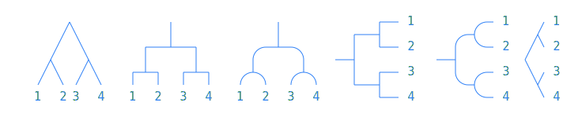
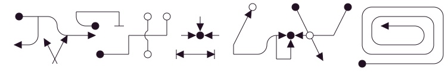
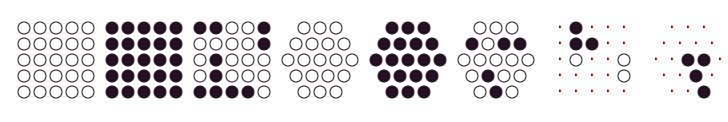
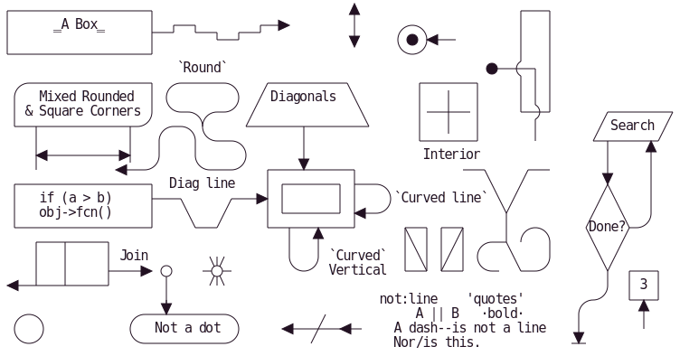
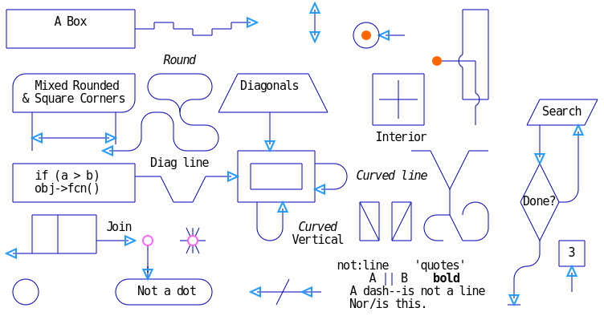

# ASCII input mode

<!-- https://docs.github.com/en/get-started/writing-on-github/working-with-advanced-formatting/organizing-information-with-collapsed-sections#creating-a-collapsed-section -->

GoAT implements a subset, and some extensions, of the ASCII diagram generation function of the browser-side Javascript in [Markdeep](http://casual-effects.com/markdeep/).

If ASCII-mode is selected on the command line (the default),
 all characters that affect drawing lie within the ASCII set.
Certain Unicode graphical characters e.g. MIDDLE DOT may however be useful, and
in at least some on-screen fonts, conform to the constant pixel-dimension standard of the ASCII range.

CJK characters on the other hand are typically wider than 2:1.
Non-standard width characters are not in general composable on the left-right axis within a plain-text
drawing, because the remainder of the line of text to their right is pushed out of alignment
with rows above and below.


## Example Graphics

Here are some snippets of
GoAT-formatted text
and the SVG each can generate.
The SVG you see below was linked to by
inline Markdown image references
([howto](https://docs.github.com/en/get-started/writing-on-github/getting-started-with-writing-and-formatting-on-github/basic-writing-and-formatting-syntax#images),
[spec](https://github.github.com/gfm/#images)) from
GoAT's [README.md](README.md), then finally rendered to HTML `````` elements by Github's Markdown processor


### Trees -- mid-range color value
Setting a foreground color in the middle of the possible range of value or luminance
is one way to work around a limitation of certain browsers e.g. Safari.
Safari does not support inheritance of
the [`color-scheme`](https://developer.mozilla.org/en-US/docs/Web/CSS/@media/prefers-color-scheme)
CSS property by
`goat`'s output `<svg>` element
from within an enclosing `` element such as are generated by Markdown.




### Overlaps
<!--  XX  If GFM could merely "#include" other input files upon HTML generation,
          following the usual mode of included images, could templating perhaps be dropped?

           E.g.
                  [CANNOT #include ](./examples/overlaps.txt)
  -->   
```

           .-.           .-.           .-.           .-.           .-.           .-.
          |   |         |   |         |   |         |   |         |   |         |   |
       .---------.   .--+---+--.   .--+---+--.   .--|   |--.   .--+   +--.   .------|--.
      |           | |           | |   |   |   | |   |   |   | |           | |   |   |   |
       '---------'   '--+---+--'   '--+---+--'   '--|   |--'   '--+   +--'   '--|------'
          |   |         |   |         |   |         |   |         |   |         |   |
           '-'           '-'           '-'           '-'           '-'           '-'

```
---


### Line Decorations
```
                ________                            o        *          *   .--------------.
   *---+--.    |        |     o   o      |         ^          \        /   |  .----------.  |
       |   |    '--*   -+-    |   |      v        /            \      /    | |  <------.  | |
       |    '----->       .---(---'  --->*<---   /      .+->*<--o----'     | |          | | |
   <--'  ^  ^             |   |                 |      | |  ^    \         |  '--------'  | |
          \/        *-----'   o     |<----->|   '-----'  |__|     v         '------------'  |
          /\                                                               *---------------'

```
---


### Dot Grids
```

  o o o o o  * * * * *  * * o o *    o o o      * * *      o o o     · * · · ·     · · ·
  o o o o o  * * * * *  o o o o *   o o o o    * * * *    * o * *    · * * · ·    · · · ·
  o o o o o  * * * * *  o * o o o  o o o o o  * * * * *  o o o o o   · o · · o   · · * * ·
  o o o o o  * * * * *  o * o o o   o o o o    * * * *    o * o o    · · · · o    · · * ·
  o o o o o  * * * * *  * * * * o    o o o      * * *      o * o     · · · · ·     · · *


```
Note that '·' above is not ASCII, but rather Unicode, the MIDDLE DOT character, encoded with UTF-8.


### "Complicated"
```
+-------------------+                           ^                      .---.
|      ‗A Box‗      |__.--.__    __.-->         |      .-.             |   |
|                   |        '--'               v     | * |<---        |   |
+-------------------+                                  '-'             |   |
                        `Round`                                    *---(-. |
  .-----------------.  .-------.    .----------.         .-------.     | | |
 |   Mixed Rounded  | |         |  / Diagonals  \        |   |   |     | | |
 | & Square Corners |  '--. .--'  /              \       |---+---|     '-)-'       .--------.
 '--+------------+-'  .--. |     '-------+--------'      |   |   |       |        / Search /
    |            |   |    | '---.        |               '-------'       |       '-+------'
    |<---------->|   |    |      |       v                Interior                 |     ^
    '           <---'      '----'   .-----------.              ---.     .---       v     |
 .------------------.  Diag line    | .-------. +---.              \   /           .     |
 |   if (a > b)     +---.      .--->| |       | |    |`Curved line` \ /           / \    |
 |   obj->fcn()     |    \    /     | '-------' |<--'                +           /   \   |
 '------------------'     '--'      '--+--------'      .--. .--.     |  .-.     +Done?+-'
    .---+-----.                        |   ^           |\ | | /|  .--+ |   |     \   /
    |   |     | Join        \|/        |   | `Curved`  | \| |/ | |    \    |      \ /
    |   |     +---->  o    --o--        '-'  Vertical  '--' '--'  '--  '--'        +  .---.
 <--+---+-----'       |     /|\                                                    |  | 3 |
                      v                             not:line    'quotes'        .-'   '---'
  .-.             .---+--------.            /            A || B   ·bold·       |        ^
 |   |           |   Not a dot  |      <---+---<--    A dash--is not a line    v        |
  '-'             '---------+--'          /           Nor/is this.            ---

```
---


### "Complicated" redux, styled in motley


### More [examples](./examples)
