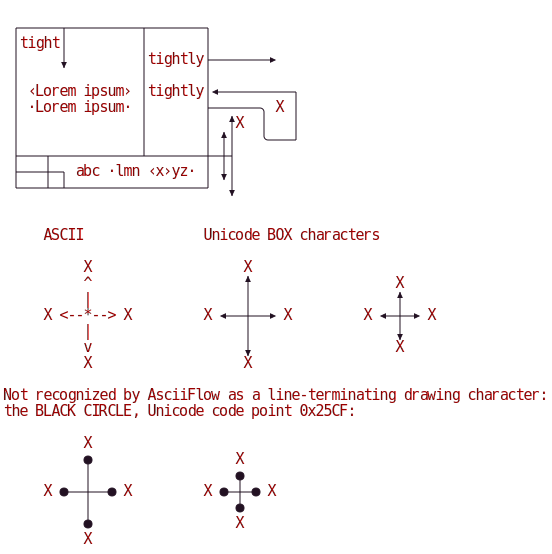
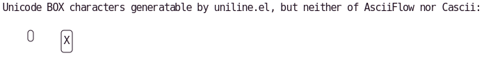

# UTF-8 Box-drawing mode

You will also need and editor capable of manipulating the Unicode
 BOX characters (code points 0x25xx).

Ordinary text editors with "rectangle-mode" support may be suitable.
More ergonomic are:
 - [Cascii](https://github.com/casparwylie/cascii-core)
 - [AsciiFlow](https://github.com/lewish/asciiflow)
 - For Emacs users, ```picture-mode``` or [uniline.el](https://github.com/tbanel/uniline)

## Font Compatibility
GoAT requires curating one's choice of fonts, to avoid introducing characters of non-standard width or height
 into the rectangular grid.
Use of utf8-mode generally tightens the curation requirement, because many popular body fonts, while
 though nominally monospace, actually select Unicode box-drawing glyphs of non-standard dimension.

Known suitable font, available on Debian distros: "DejaVu Sans Mono".

## Example Graphics
A highly abstract view of GoAT's internal data flow, using UTF-8 text:
```
                                          ╭─────────────╮
                                          │SVG graphics │                 ╭───────────────╮
┌         ┐ ╭─────────╮ ┌             ┐   │ generation  │                 │ concatenation │
`annotated` │         │  / recovered /    │  ╭──────────┤                 ├ ─ ─ ─ ─ ┐     │
 `diagram,` │ diagram │  /  source-  /    │  │/generic/ ●─────────────────▶               │
`ASCII or`●─▶ parsing ●─▶/independent/╶─┬───▶├──────────┤   ╭─────────╮   │         │     │
╷₁`UTF-8`₁  │         │  / structure /  │ │  │/source-/ │ ╭─▶  ASCII  ●─╮ │               │
└         ┘ ╰─────────╯ └             ┘ │ │  │/specific/├╴× ├─────────┤ ×─▶         │     │
                                        │ │  │          │ ╰─▶UTF8-BOX ●─╯ │   SVG         │  ┌          ┐
                     ╭───────────────╮  │ ╰──┴──────────╯   ╰─────────╯   │ elements│     │  `CSS-styled`
                     │ extraction of │  │ ╭───────────────┬────────────╮  │               ├─▶`₃SVG₃file`
                     │ CSS class-    │  ╰─▶ text positions  *<a>*and   │  │         │     │  └          ┘
┌            ┐       │ names and     │    ├╴ ─ ─ ─ ─ ─ ─ ─┤ *<text>*   ├──▶               │
₂ CSS files₂○─────┬──▶ *goat-anchor* ├────▶    anchor     ╷ generation │  ├ ─ ─ ─ ─ ┤     │
└            ┘    │  │ properties    │    │   class names ╵            │  │               │
                  │  ╰───────────────╯    ╰───────────────┴────────────╯  │   CSS   │     │
                  ╰───────────────────────────────────────────────────────▶               │
                                                                          ╰─────────┴─────╯

```
Processed to SVG, with garishly colorful CSS styling from [`embed:palette/bold.css`](./css/palette/bold.css):


Processed to SVG, with unobtrusively colored CSS styling from [`embed:palette/earth.css`](./css/palette/earth.css):


### Input from AsciiFlow
```

 ┌─────┬─────────┬───────┐
 │tight│         │       │
 │     ▼         │tightly├───────►
 │               │       │
 │ ‹Lorem ipsum› │tightly│◄─────────┐
 │ ·Lorem ipsum· │       ├──────╮ X │
 │               │       │  ▲X  │   │
 │               │       │ ▲│   ╰───┘
 ├───┬───────────┴───────┼─┼┤
 ├───┼─┐ abc ·lmn ‹x›yz· │ ▼│
 └───┴─┴─────────────────┘  ▼


     ASCII               Unicode BOX characters

          X                   X
          ^                   ▲                  X
          |                   │                  ▲
     X <--*--> X         X ◄──┼──► X         X ◄─┼─► X
          |                   │                  ▼
          v                   ▼                  X
          X                   X

Not recognized by AsciiFlow as a line-terminating drawing character:
the BLACK CIRCLE, Unicode code point 0x25CF:

          X
          ●                  X
          │                  ●
     X ●──┼──● X         X ●─┼─● X
          │                  ●
          ●                  X
          X

```
---

### Input from Uniline.el
```
Unicode BOX characters generatable by uniline.el, but neither of AsciiFlow nor Cascii:

    ╭╮    ╭─╮
    ╰╯    │X│
          ╰─╯

```
---

